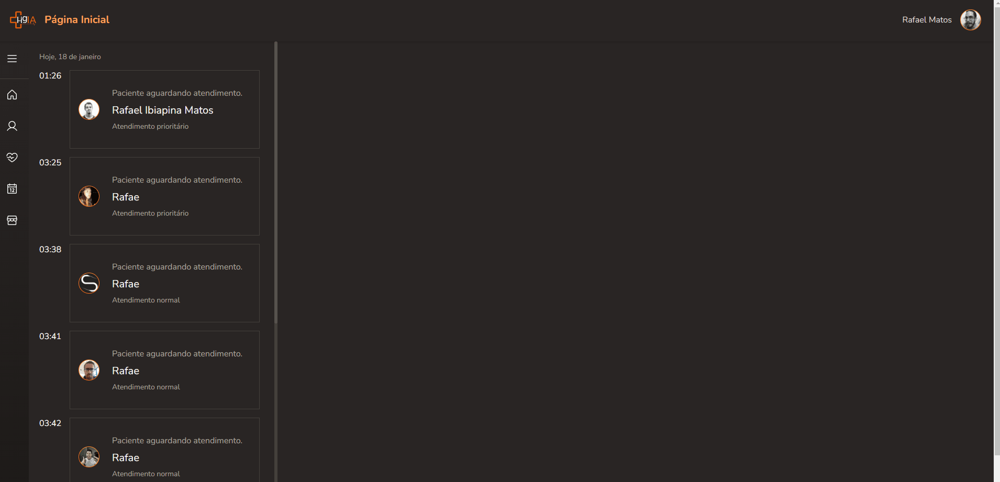

# Service Queue🏥

Sistema para clinica médica para manutenção da fila de atendimento de pacientes em um sistema médico. Aplicação full stack, utilizando o conceito de backend for frontend permitido pelo framework Next.js;




<!-- <details>
    <summary>Responsivo</summary>
    
</details> -->

## Tecnologias usadas ⚙

- Next.js
- React.js
- Typescript
- Zod
- React Hook Form
- Prisma
- Axios
<!-- - Ignite-ui -->
<!-- - Nookies -->
<!-- - NextAuth.js
- DayJs
- Google Apis -->

## Atualizações 🔃

  <!-- <details>
    <summary>Histórico</summary>

      - Adicionado a configuração pageExtensions do Next.js;

    
</details> -->

  - Criando página de agendamento;

  - Tela de acesso de funcionário e paciente
  - Cadastro de paciente
  - Confirmação de consulta
  - Listagem de consultas
  - Acesso de funcionario pelo CPF
  - Criado layout padrão da aplicação
  - Redefinindo páginas de funcionário
  - Adicionado botões de atualização ed status da consulta
  - Criada rota de atualização de consulta


  <!--  -->
  
  

## Como utilizar

- Clone o projeto do repositório

```
git clone https://github.com/RafaelMatos/serviceQueue
```

- Acesse a pasta do projeto

```
cd serviceQueue
```

- Instale as dependências

```
npm install
```
- Criar arquivo .env com as chaves necessarias( seguir arquivo .envExample)

- Inicializa o Prisma( Usar banco de dados de sua preferencia, no exemplo é usado o mysql)

```
npx prisma init --datasource-provider mysql
```
- Realiza as migrations do Prisma

```
npx prisma migrate dev --name init
```

- Execute o projeto

```
npm run dev
```

- Acesse no navegador o endereço indicado no terminal
